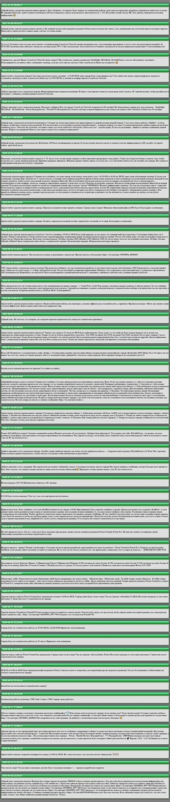

# Описание веб модуля для Launcher Minecraft ["LazerLast"](https://vk.com/lazerlast)

**LazerLast** - это игровой проект созданый в рамках игры "Minecraft", а именно - сервер, на котором были реализованы в период с 2019-2021 гг. различные игровые режимы (Prison, SkyBlock и др.).

---

Данное приложение является отдельным самостоятельным модулем, написанным на языке php. Его работа основана на VK API: на стороне сервера приложение делает запрос к API, которое в ответ выдаёт JSON со всеми записями со стены группы в данной социальной сети. Затем информация из этих записей выводится в Web интерфейс, который отображается в интерфейсе игрового лаунчера.

---

# Description of web module for Launcher Minecraft ["LazerLast"](https://vk.com/lazerlast)

**LazerLast** - this game project, created in within computer game "Minecraft" (game server). On him was realized in 2019-2021 years different game modes (Prison, SkyBlock and other).

---

This application is a separate standalone module written in PHP. Its operation is based on the VK API: on the server side, the application sends a request to the API, which responds with JSON data containing all posts from the group's wall in this social network. Then, the information from these posts is displayed in a web interface, shown in the interface of the game launcher.

---

*screenshot/Скриншот*
